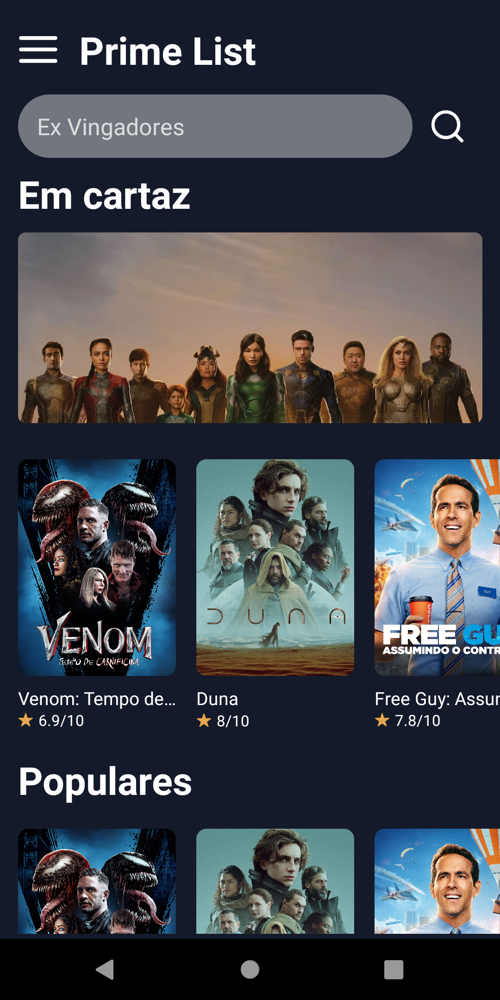
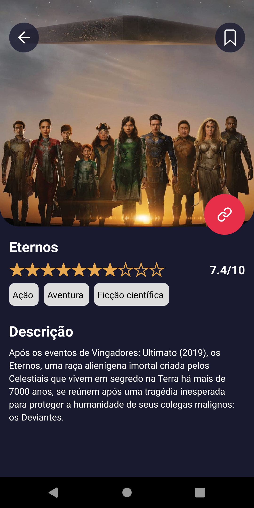
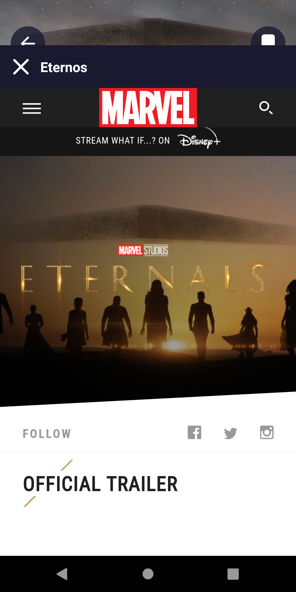
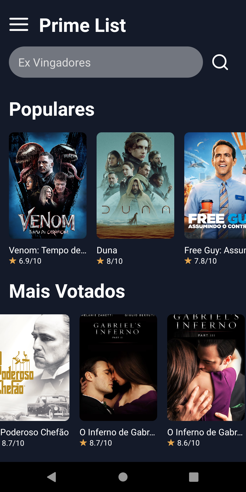
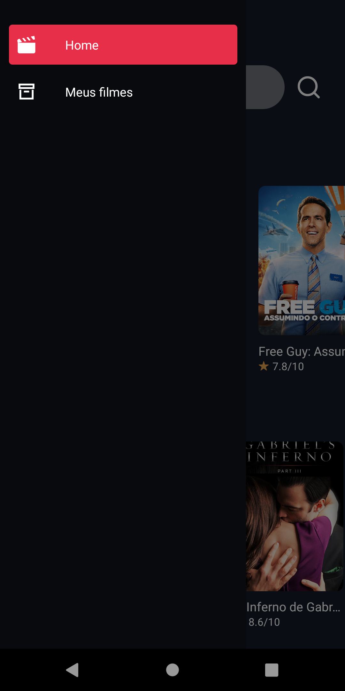
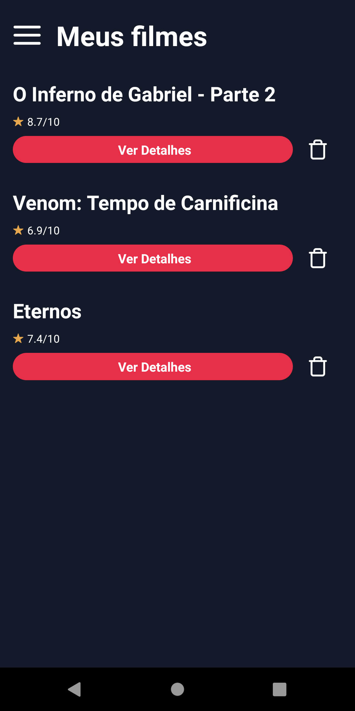
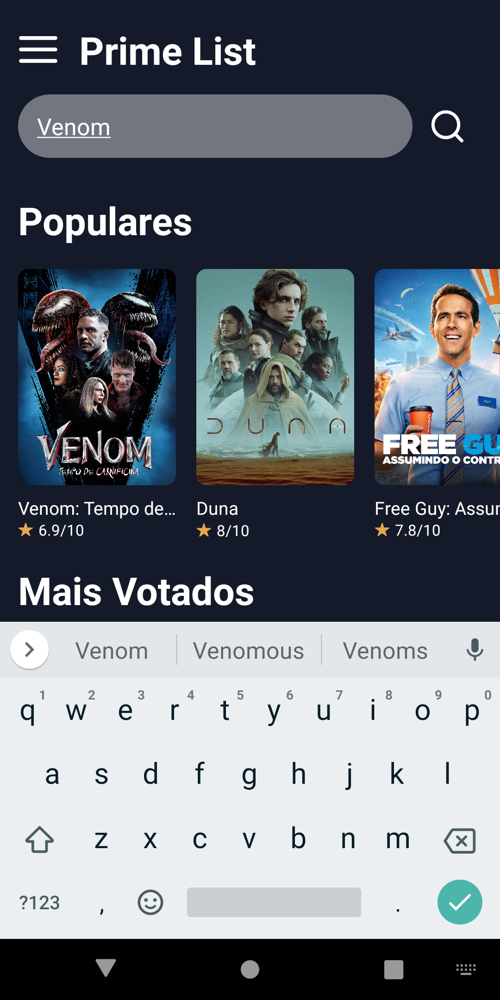
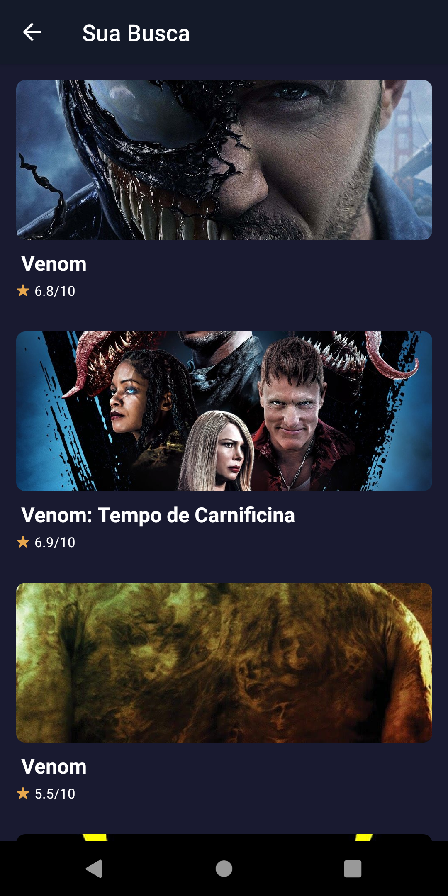

#Prime List app

## Introduction:

Getting Started with Create React App
This project was started with the Create React app.

## Available Scripts
From the project directory, you can run:

expo start
Run the application in development mode.
Open http://localhost:19002 to view it in browser.
Choose which platform you want to run the app on.

## Description
An app developed with the technology [React Native](https://reactnative.dev), using the API of [The Move API](https://www.themoviedb.org/), to stay informed about current movies , with a simple interface with nice layout. Need internet connection to work.

## Download of APK
1. Click here -> [App Prime List](https://drive.google.com/file/d/1J8u76mLWh7IbgK3xnqaGyQd4F-_ZO8LQ/view?usp=sharing)
2. And then click on download.

## Project Images:

  
  
  
  
   
   
   
   

